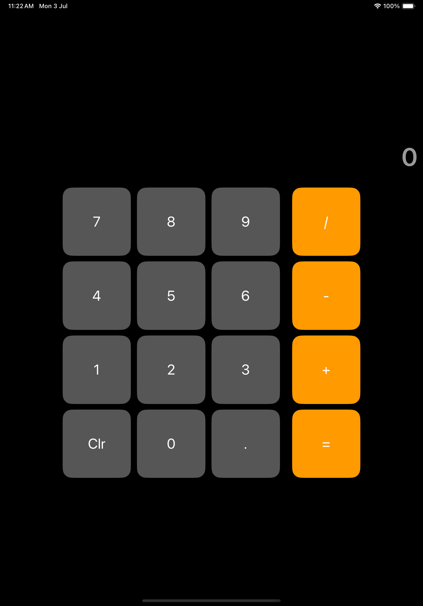
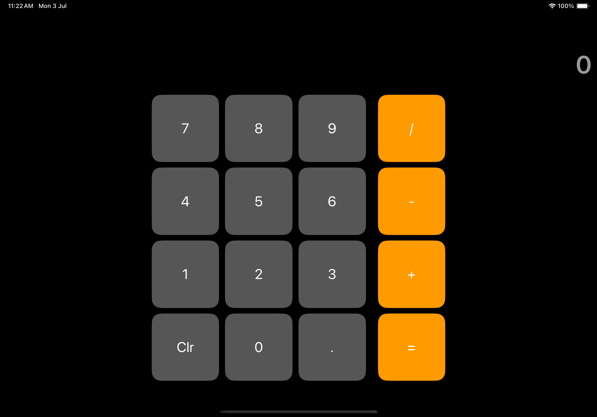
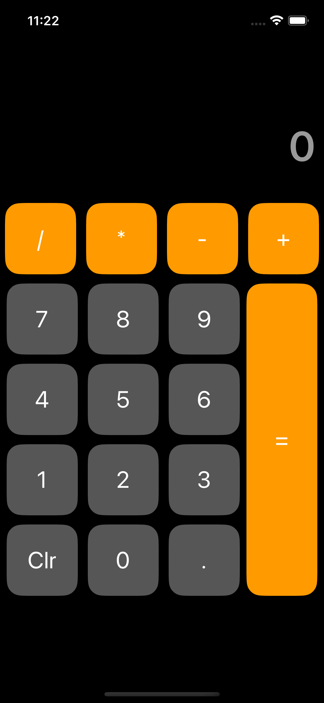

# Calculator Swift Package
> A package which provide a calculator view and shows its result
>
##Screenshots






## Installation

Add this project on your `Package.swift`

```swift
import Calculator

let package = Package(
    dependencies: [
        .Package(url: "https://github.com/vinay1357/Calculator", majorVersion: 0, minor: 0)
    ]
)
